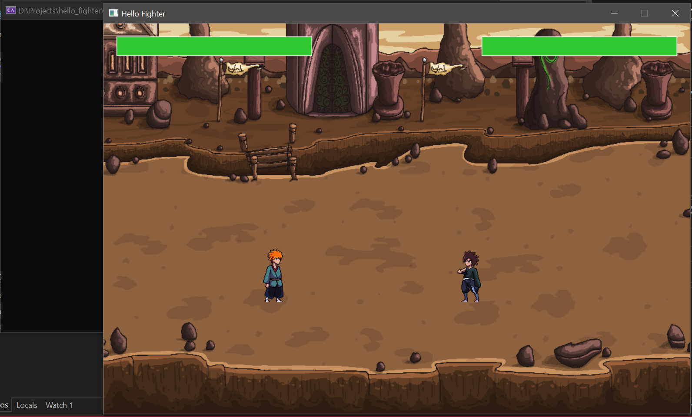

# Hello Fighter - 2D Fighting Game

A local multiplayer 2D fighting game built with C++ and SDL2. Battle against a friend with two unique characters, each with their own attack moves and animations.


## Features

- **Local Multiplayer**: Two-player combat on the same keyboard
- **Unique Characters**: Fighter and Shinobi, each with distinct sprites and animations
- **Combat System**: Multiple attack types, blocking, jumping, and health management
- **Dynamic Backgrounds**: Random background selection for each match
- **Health Bars**: Real-time health tracking with visual bars
- **Smooth Animations**: Frame-based sprite animations for all actions

## Game Mechanics

### Combat Features
- **3 Attack Types**: Light, medium, and heavy attacks with different animations
- **Shield/Block**: Defend against incoming attacks
- **Jump Mechanics**: Jump to avoid attacks or gain tactical advantage
- **Hit Detection**: Collision-based combat with attack hitboxes
- **Damage System**: Health depletion with hit cooldown to prevent spam
- **Death Animations**: Unique death sequences when health reaches zero

### Controls

#### Player 1 (Fighter)
- **Arrow Keys**: Move left/right
- **Up Arrow**: Jump
- **Down Arrow**: Shield/Block
- **A**: Light Attack
- **S**: Medium Attack
- **D**: Heavy Attack

#### Player 2 (Shinobi)
- **A/D Keys**: Move left/right
- **W**: Jump
- **J**: Shield/Block
- **U**: Light Attack
- **I**: Medium Attack
- **O**: Heavy Attack

## Prerequisites

- C++ Compiler (C++11 or later)
- SDL2 Library
- SDL2_image Library

### Installing Dependencies

#### Windows (MinGW/MSYS2)
```bash
pacman -S mingw-w64-x86_64-SDL2
pacman -S mingw-w64-x86_64-SDL2_image
```

#### Linux (Ubuntu/Debian)
```bash
sudo apt-get install libsdl2-dev
sudo apt-get install libsdl2-image-dev
```

#### macOS (Homebrew)
```bash
brew install sdl2
brew install sdl2_image
```

## Project Structure

```
hello_fighter/
├── Player.h                 # Player class header
├── Player.cpp               # Player class implementation
├── main.cpp                 # Main game loop
├── fighter/                 # Fighter character sprites
│   ├── Idle.png
│   ├── Run.png
│   ├── Jump.png
│   ├── Attack_1.png
│   ├── Attack_2.png
│   ├── Attack_3.png
│   ├── Shield.png
│   └── Dead.png
├── shinobi/                 # Shinobi character sprites
│   ├── Idle.png
│   ├── Run.png
│   ├── Jump.png
│   ├── Attack_1.png
│   ├── Attack_2.png
│   ├── Attack_3.png
│   ├── Shield.png
│   └── Dead.png
└── backgrounds/             # Game backgrounds
    ├── game_background_1/
    ├── game_background_2/
    ├── game_background_3/
    └── game_background_4/
```

## Building the Game

### Using g++ (Command Line)
```bash
g++ main.cpp Player.cpp -o HelloFighter -lSDL2 -lSDL2_image
```

### Using Visual Studio
1. Create a new C++ project
2. Add all `.cpp` and `.h` files to the project
3. Configure project to link against SDL2 and SDL2_image
4. Build and run

### Using CMake (Example)
```cmake
cmake_minimum_required(VERSION 3.10)
project(HelloFighter)

set(CMAKE_CXX_STANDARD 11)

find_package(SDL2 REQUIRED)
find_package(SDL2_image REQUIRED)

add_executable(HelloFighter main.cpp Player.cpp)
target_link_libraries(HelloFighter SDL2::SDL2 SDL2_image::SDL2_image)
```

## Configuration

### Asset Paths
Update the asset paths in `main.cpp` to match your directory structure:

```cpp
// Background paths
const std::vector<std::string> bgVector = {
    "backgrounds/game_background_1/game_background_1.png",
    "backgrounds/game_background_2/game_background_2.png",
    // ... more backgrounds
};

// Character sprite paths
player1.addAnimation(renderer, "idle", "fighter/Idle.png", 6, 12);
player2.addAnimation(renderer, "idle", "shinobi/Idle.png", 6, 12);
```

### Game Settings

Adjust these constants in the code:

**Screen Resolution** (main.cpp):
```cpp
const int SCREEN_WIDTH = 900;
const int SCREEN_HEIGHT = 600;
```

**Player Physics** (Player.h):
```cpp
float gravity = 0.8f;          // Gravity strength
float jumpStrength = -15.0f;   // Jump power
float groundY = 300;           // Ground level
```

**Combat Parameters** (Player.h):
```cpp
float maxHealth = 100.0f;      // Starting health
Uint32 hitCooldown = 500;      // Hit invulnerability (ms)
```

**Damage Values** (main.cpp):
```cpp
float damage = 5.0f;           // Damage per hit
```

## Gameplay Tips

1. **Spacing**: Maintain proper distance to land attacks while avoiding enemy hits
2. **Shield Timing**: Use shield strategically - you can't attack while blocking
3. **Attack Variety**: Mix up your attacks to keep opponents guessing
4. **Jump Attacks**: Jumping can help you avoid low attacks
5. **Hit Cooldown**: There's a 500ms cooldown after taking damage, so use that time to counter-attack

## Customization Ideas

### Easy Modifications

**Change Damage Per Attack**:
```cpp
// In main.cpp, combat system section
if (player1.getIsAttacking()) {
    float damage = 5.0f;
    if (currentAttackType == "attack1") damage = 3.0f;
    if (currentAttackType == "attack2") damage = 7.0f;
    if (currentAttackType == "attack3") damage = 10.0f;
    player2.takeDamage(damage);
}
```

**Adjust Attack Range** (Player.cpp):
```cpp
int attackRange = 80;   // Distance in pixels
int attackWidth = 60;   // Width of attack zone
int attackHeight = 80;  // Height of attack zone
```

**Change Movement Speed** (Player.cpp):
```cpp
x += 3;  // Change 3 to any value for speed
```

### Advanced Modifications

- Add sound effects for hits, jumps, and attacks
- Implement combo system with hit counters
- Add special moves with unique key combinations
- Create a round-based system with win conditions
- Add power-ups or health pickups
- Implement AI for single-player mode
- Add more characters with unique abilities

## Debug Mode

The game includes visual debugging for hitboxes:
- **Green Rectangles**: Player body colliders
- **Red Rectangles**: Active attack zones

To disable debug visuals, comment out these lines in `main.cpp`:
```cpp
// SDL_SetRenderDrawColor(renderer, 0, 255, 0, 255);
// SDL_RenderDrawRect(renderer, &player1.getCollider());
// SDL_RenderDrawRect(renderer, &player2.getCollider());
```

## Known Issues

- Players can overlap if they move into each other
- No round/match system implemented yet
- No sound effects or music
- Death animation doesn't restart the game

## Future Enhancements

- [ ] Round-based system with victory conditions
- [ ] Character select screen
- [ ] Sound effects and background music
- [ ] Special moves and combos
- [ ] AI opponent for single-player
- [ ] Online multiplayer support
- [ ] More characters and stages
- [ ] Tournament mode
- [ ] Replay system

## Credits

- Game developed using SDL2 library
- Character sprites: [[Craftpix](https://craftpix.net)]
- Background art: [[Craftpix](https://craftpix.net)]


## Contributing

Feel free to fork this project and submit pull requests with improvements!

## Support

For issues or questions, please open an issue on the project repository.

---

**Enjoy the fight!** 🥊
